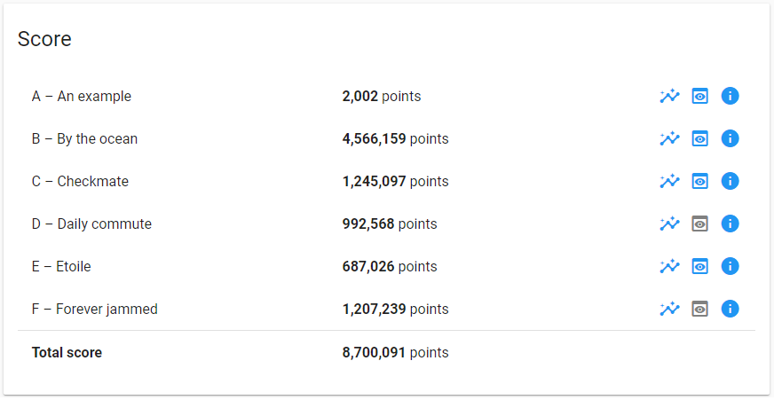

# Google HashCode 2020 solution
Our solution version of Google HashCode 2020 online qualification round - Traffic signaling as Hush, cod! team.

## Authors

*   **Giovanni Roma**  - [github](https://github.com/JoGist)
*   **Alessio Parmeggiani**  - [github](https://github.com/Alessio-Parmeggiani)
*   **Alessio Sfregola**  - [github](https://github.com/Alessio-17)

## Problem Introduction 
Introduction
The world's first traffic light dates back to 1868. It was installed in London to control traffic for... horse-drawn vehicles! Today, traffic lights can be found at street intersections in almost every city in the world, making it safer for vehicles to go through them.

Traffic lights have at least two states, and use one color (usually red) to signal "stop", and another (usually green) to signal that cars can proceed through. The very first traffic lights were manually controlled. Nowadays they are automatic, meaning that they have to be carefully designed and timed in order to optimize the overall travel time for all the paicipants in traffic.

## The task 
Given the description of a city plan and planned paths for all cars in that city, optimize the schedule of trac lights to minimize the total amount of time spent in traffic, and help as many cars as possible reach their destination before a given deadline.


## Code usage
To run the script solution.py, just run the following command:
```sh
python solution.py 
```

All output files will be generated automatically.

## Our best score


## Scoreboard
https://hashcodejudge.withgoogle.com/scoreboard
